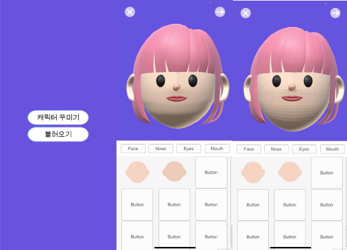
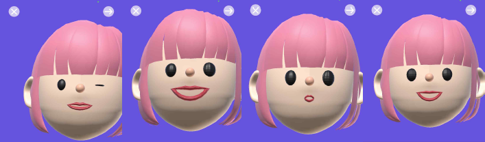
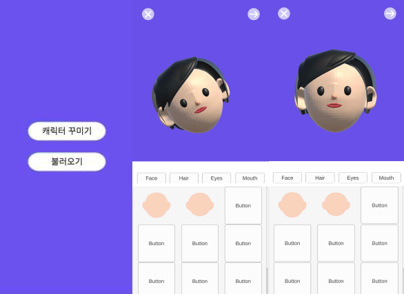

# Real-timeMaskingVirtualAvatar
## 유니티 엔진으로 실시간 마스킹 가상 아바타 만들기 - (박지훈,양수빈,임지윤)
### 시스템 기능
- iOS Face Tracking (ARKit)
    - Unity 에디터의 편집 모드와 재생 모드 모두에서 작동
    - 얼굴 추적
        - Apple의 ARKit을 통한 52개의 블렌드 셰이프의 얼굴 추적 가능
    - 워크플로우
        - LiveCapture 시스템을 활용
        - LiveCapture 패키지에 얼굴 캡쳐 테스트를 위한 샘플 리깅 헤드 포함
    - 모션캡쳐
    - 인물 오클루전

- Android Face Tracking (ARCore) 
    - Unity XR 지원
        - AR Foundation 및 ARCore XR Plugin 패키지를 설치하고 Project Setting > XR Plugin-in Management(Android)에서 ARCore플러그인 선택
    - 추적 문제 감지
        - ARSession에서 제공하는 notTrackingReason을 사용하고 NotTrackingReason을 반환
    - 증강 얼굴
        - ARFaceManager에서 제공하는 얼굴 추적 사용
    - 특정 포인트
        - ARPointCloudManager에서 제공하는 Point Clouds 사용

### 실행환경
- Unity: 2021.3.20f1
- AR Foundation 및 AR_ XR Plugin: 4.1.5
- Xcode: 14.1

### 실행방법
- iOS Face Tracking (ARKit)
    1. Unity AR 기본 세팅
        - Unity에 AR Foundation, ARKit XR Plugin, ARKit Face Tracking 설치.
        - Unity Hierarchy에 AR Session Origin과 AR Session 추가.
            - AR Session Origin은 디바이스 카메라로 추적한 요소들의 상대적인 위치를 계산하여 유니티 Scene의 World Space로 변환하는 역할을 수행한다. 자식 오브젝트로는 ARCamera를 포함하고있어 기본으로 추가되어있는 MainCamera는 삭제해준다.
            - AR Session은 AR 기능 활성을 제어하는 역할을 한다.
            - AR Camera에서 Facing Direction을 World에서 User로 바꾸어준다. 이는 디바이스의 후면 카메라에서 전면 카메라로 변경하는 작업이다.
        - AR Session Origin에 AR Face Manager Component 추가.
            - AR Face Manager은 사용자의 얼굴을 추적하여 감지된 얼굴을 Face Prefab으로 인스턴트화 하여 Face Tracking을 구현해주는 요소이다.

    2. UI 제작
        - Button 제작
            - Adobe Illustrator를 활용하여 Button에 들어갈 이미지를 만든다.
        - Unity의 Game화면을 테스트용 iPhone 크기에 맞게 변경.
        - Scroll View 추가.
            - Scroll 기능을 통해 다양한 커스텀 요소를 선택할 수 있도록 한다.
        - Button 추가.
            - Face, Nose, Eye 등 버튼을 추가하여 각각에 연결된 아바타의 눈코입을 커스텀 할 수 있도록 한다.
            - ‘캐릭터 꾸미기’, ‘불러오기’, Back, Next 버튼을 통해 Scene 이동을 한다.
            - 만들었던 Button 이미지를 Button의 Image Component에 연결한다.
            
    3. 아바타와 사용자 얼굴 연결
        - 아바타를 Prefab으로 변경.
            - 만들어둔 아바타 .fbx 파일을 Unity로 가져와 GameObject로 만들어준다.
            - 아바타 GameObject에 AR Face Component와 BlendShape를 연결해줄 New ScriptComponent를 추가해준다.
            - Asset 폴더에 Prefabs 폴더를 추가하고 그 안에 아바타 Gameobject를 넣어 Prefab으로 만들어준다.
        - Script 작성
            - SkinnedMeshRenderer에서 BlendShape Parameter 목록을 가져온다.
            - ARKit에서 제공하는 위치값을 가져오고 자동으로 연결한다.
            - 아바타에서 움직이고 싶은 BlendShape 값을 가져온다.
            - CoefficientValueScale의 값이 들어오면 블랜더에서는 0~1의 값 사이에서 작동하지만 Unity에서는 0~100의 값으로 작용되기 때문에 100f로 설정해준다.
            - Dictonary(ARKitBlendShapeLocation,..) 블랜더에서 들어오는 Key값을 newDictionary(ARKitBlendShapeLocation,...) 아이폰으로 들어오는 Key값으로 받는 코드를 적어준다.
            - 추가하고 싶은 초기값 ()안의 ARKitBlendShapeLocation._과 _f는 측정하고싶은 값이다. 값의 코드를 추가한다.
            - 얼굴 정보가 갱신될 때마다 Table에 들어있는 Key Value값을 갱신한다.
            - Face가 디바이스 화면에 들어오면 Renderer가 활성화되고 얼굴이 화면에서 사라지면 렌더러가 비활성화된다.
            - 측정된 ARKit Shape을 아바타에 전달한다.
        - 아바타 GameObject는 삭제하고 아바타 Prefab을 AR Session Origin의 Component인 AR Face Manager의 Face Prefab에 연결.

    4. 커스텀 기능 구현
        - Script 작성
            - 특정 BlendShape값을 지정해주어 고정 시킨 다음, 버튼으로 연결하여 바뀔 수 있게 한다.
        - Button 연결
            - 얼굴, 코, 눈 등 각 요소 Button의 Component인 On Click()에 Set_() Button Event를 연결한다.

    5. Test
        - Platform 변경 및 Build
            - Build Setting에서 Platform을 iOS로 변경한다.
            - Playing Setting > Player> Other Settings에서 Target minimum iOS Version을13.0으로 변경하고 Requires ARKit support를 체크해준다. 그리고 Architecture를 Universal에서 ARM64로 변경해준다.
            - Scene In Build에 만들어둔 Scene을 모두 추가한다.
            - Build를 누르고 Build 폴더를 따로 만들어 저장한다.
        - Xcode 연결 및 실행
            - Build 폴더에 있는 .xcodeproj를 실행해준다.
            - Signing & Capabilities 탭에서 Team을 추가해준다. (Apple 계정 로그인)
            - Mac과 iOS 디바이스를 연결한 후 플레이 버튼을 누른다.

- Android Face Tracking (ARCore) 
    1. Unity AR 기본 세팅
        - Unity에 AR Foundation, ARCore XR Plugin 설치.
        - Unity Hierarchy에 AR Session Origin과 AR Session 추가.
            - AR Session Origin은 디바이스 카메라로 추적한 요소들의 상대적인 위치를 계산하여 유니티 Scene의 World Space로 변환하는 역할을 수행한다. 자식 오브젝트로는 ARCamera를 포함하고있어 기본으로 추가되어있는 Main Camera는 삭제해준다.
            - AR Session은 AR 기능 활성을 제어하는 역할을 한다.
            - AR Camera에서 Facing Direction을 World에서 User로 바꾸어준다. 이는 디바이스의 후면 카메라에서 전면 카메라로 변경하는 작업이다.
        - AR Session Origin에 AR Face Manager Component 추가.
            - AR Face Manager은 사용자의 얼굴을 추적하여 감지된 얼굴을 Face Prefab으로 인스턴트화 하여 Face Tracking을 구현해주는 요소이다.

    2. UI 제작
        - Button 제작
            - Adobe Illustrator를 활용하여 Button에 들어갈 이미지를 만든다.
        - Unity의 Game화면을 테스트용 Android 크기에 맞게 변경.
        - Scroll View 추가.
            - Scroll 기능을 통해 다양한 커스텀 요소를 선택할 수 있도록 한다.
        - Button 추가.
            - Face, Nose, Eye 등 버튼을 추가하여 각각에 연결된 아바타의 눈코입을 커스텀 할 수 있도록 한다.
            - Back, Next 버튼을 통해 Scene 이동을 한다.
            - 만들었던 Button 이미지를 Button의 Image Component에 연결한다.

    3. Test
        - Platform 변경 및 Build
            - Build Setting에서 Platform을 Android로 변경한다.
            - Playing Setting > Player> Other Settings에서 
                - Graphics APIs > Vulkan을 삭제한다.
                - Minimum API Level > Android 7.0으로 설정한다.
                - Scripting Backend > IL2CPP로 설정한다.
                - Target Architectures > ARM64를 체크한다.
            - Scene In Build에 만들어둔 Scene을 모두 추가한다.
            - Build를 누르고 Build 폴더를 따로 만들어 저장한다.

### 동작방법
- iOS Face Tracking (ARKit)
    1. 어플 클릭 후 '캐릭터 꾸미기' 터치
    2. 카메라 렌즈에 자기 얼굴을 가져다 댄 후, 캐릭터 얼굴이 보이는지 확인
    3. 패널에 있는 아이템으로 자신이 원하는 캐릭터 만들기 

- Android Face Tracking (ARCore) 
    1. 어플 클릭 후 '캐릭터 꾸미기' 터치
    2. 카메라 렌즈에 자기 얼굴을 가져다 댄 후, 캐릭터 얼굴이 보이는지 확인
    3. 패널에 있는 아이템으로 자신이 원하는 캐릭터 만들기 

### 결과물(화면캡쳐)
- iOS Face Tracking (ARKit)
    1. 사용자의 얼굴을 실시간으로 인식하고 추적하는 페이스 트랙킹 구현가능.
    2. 사용자의 얼굴움직임과 표정을 정확하게 추출하고 아바타에 반영할 수 있음.
    3. 버튼 클릭으로 커스텀 기능 구현
        - 눈 크기 조절 가능
        - 코 위치 조절 가능
        - 입 크기 조절 가능
        - 얼굴형 변환 가능
    
    

- Android Face Tracking (ARCore) 
    1. 사용자의 얼굴을 실시간으로 인식하고 추적하는 페이스 트랙킹 구현가능.
    

